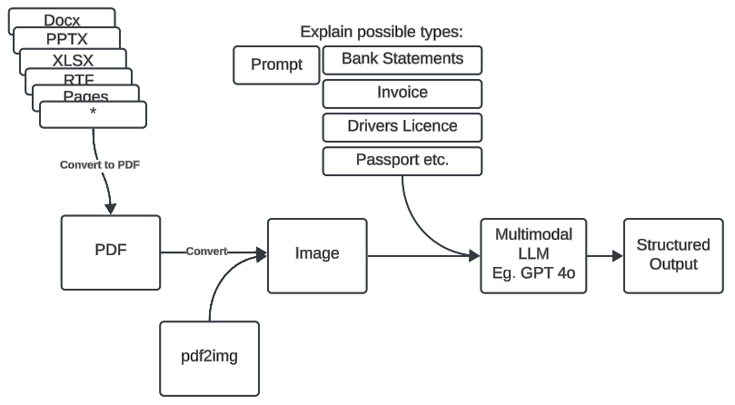

# Heron Coding Challenge - File Classifier

## Overview

At Heron, we’re using AI to automate document processing workflows in financial services and beyond. Each day, we handle over 100,000 documents that need to be quickly identified and categorised before we can kick off the automations.

This repository provides a basic endpoint for classifying files by their filenames. However, the current classifier has limitations when it comes to handling poorly named files, processing larger volumes, and adapting to new industries effectively.

**Your task**: improve this classifier by adding features and optimisations to handle (1) poorly named files, (2) scaling to new industries, and (3) processing larger volumes of documents.

## Approach
The general strategy to this problem is as follows:

- Take candidate files. If they are not PDFs or images, convert them to PDFs.
- Convert PDFs to images. Eg. using pdf2img.
- Use a multimodal LLM like GPT 4o, and use the image as input.
- Prompt the LLM and ask to classify the type of document in the image to one from the given list.
    - New document types can likely be added just by extending the list of candidate File Types. I've added some extra types like passports, receipts, utility bills, insurance policies, and credit reports.
- Use structured output to grab the output.
- Return that via the API.

### Productionising

There are some considerations around productionising the solution:
- It involves delegating to OpenAI as a tradeoff, which can be unreliable in exchange for being very flexible.
- The proposed solution is extremely IO heavy. Using something async instead of sync (like FastAPI) would allow for much more concurrent requests.
    - Converting PDFs to images with poppler would be a container local dependency. It should be leveraged via a ThreadPool to avoid blocking requests (Not implemented).
- To mitigate an external dependency like OpenAI, can have a multi tier approach, where we can fall back to cheaper/less capable/local classifiers when needed.
- I've added integration tests to flex the files against our solution. This tests examples files against all of the supported file types.

Current Approach:


Possible Approach backed by an async queue:


## Running Locally
This uses [uv](https://docs.astral.sh/uv/) to sort Python / Virtual Environment / Dependencies ([install instructions](https://docs.astral.sh/uv/getting-started/installation/)). All commands are run with
```
uv run ...
```

There is a dependency on OpenAI. See the `.env.example`. Add your own `.env` and `source` it. ie. Make sure you have a `OPENAI_API_KEY` env variable populated. This includes for tests.

To run (integration) tests:
```
uv run pytest
```

To run the app locally:
```
uv run uvicorn src.app:app
curl -X POST -F 'file=@path_to_file.pdf' http://127.0.0.1:8000/classify_file
```

For format/lint:
```
uv run ruff check
uv run ruff format
```
